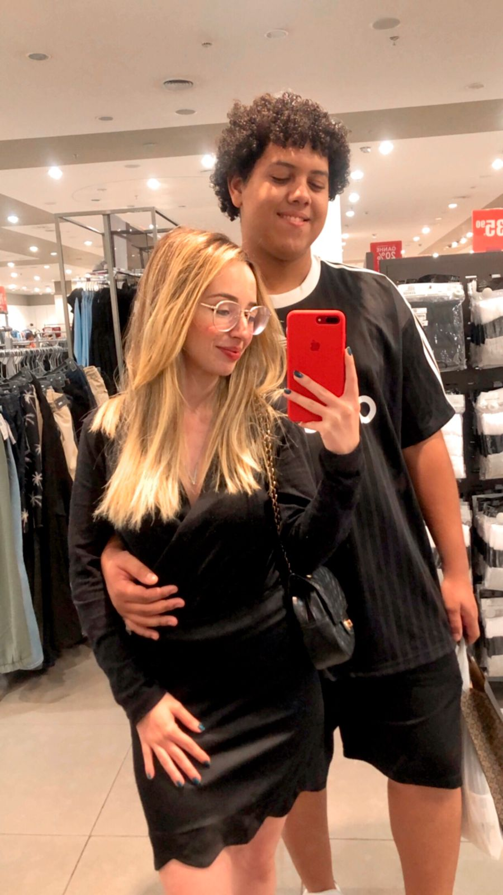
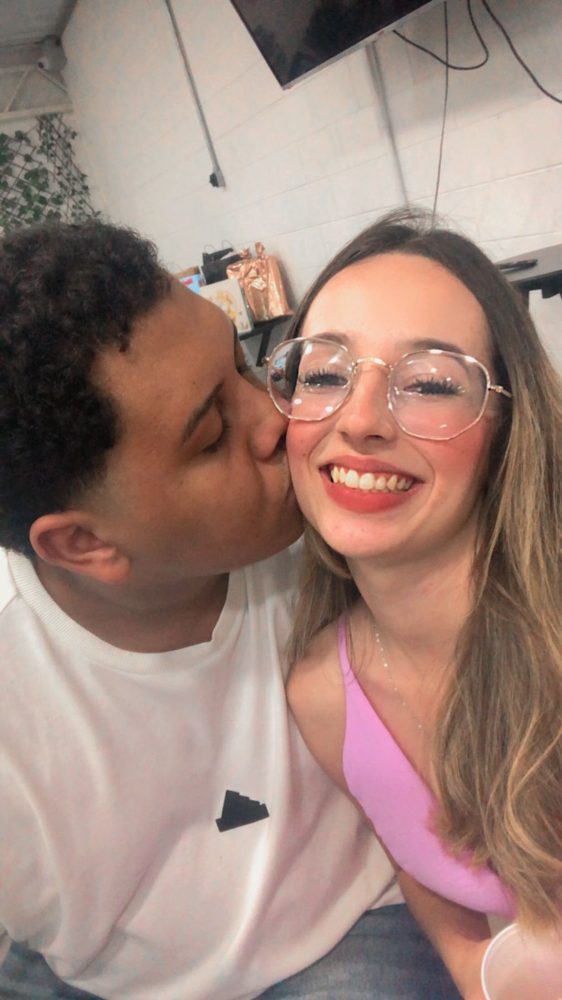
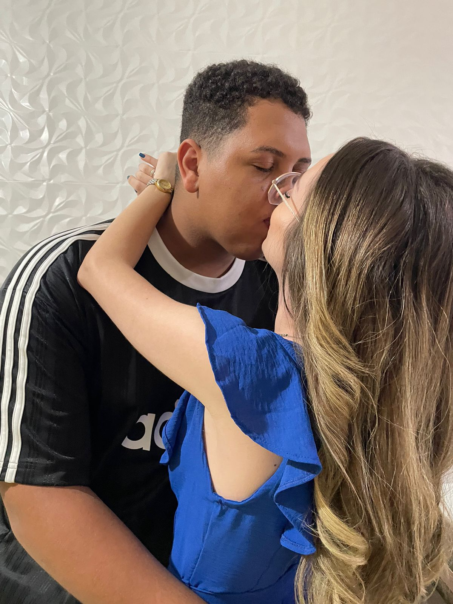
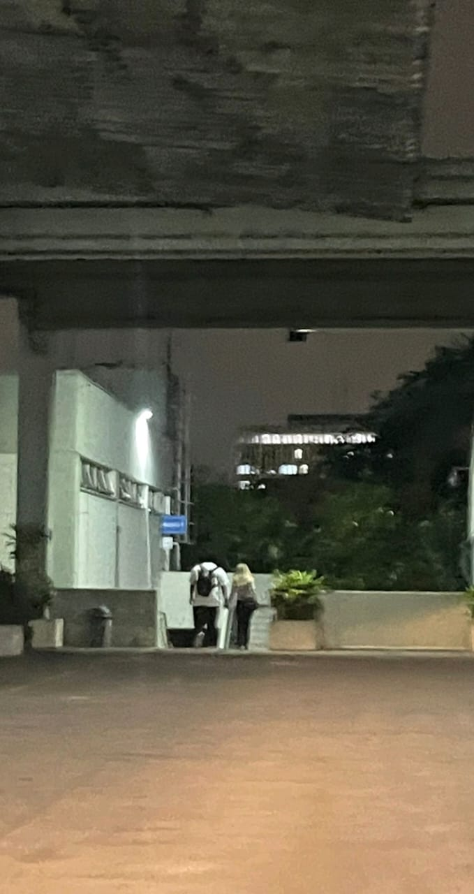

<html lang="pt-br">
<head>
  <meta charset="utf-8" />
  <meta name="viewport" content="width=device-width, initial-scale=1" />
  <title>Nosso Amor 💖</title>
  <link rel="preconnect" href="https://fonts.googleapis.com">
  <link rel="preconnect" href="https://fonts.gstatic.com" crossorigin>
  <link href="https://fonts.googleapis.com/css2?family=Poppins:wght@300;400;600;700&display=swap" rel="stylesheet">
  
</head>
<body>
  

    <header>
      <!-- Substitua as imagens abaixo por fotos de vocês (mantenha os nomes/pastas ou ajuste os src) -->
      
      

        <h1>Guilherme ❤ Viviane</h1>
        
Juntos desde 

      

    </header>

    <section class="card" aria-labelledby="contador-title">
      <h2 id="contador-title" style="margin:6px 0 4px">Quanto tempo estamos namorando</h2>
      

        

0

anos

        

0

meses

        

0

dias

        

0

horas

        

0

min

        

0

seg

      

    </section>

    <section class="card" aria-labelledby="fotos-title">
      <h2 id="fotos-title" style="margin:6px 0 10px">Nossas fotos</h2>
      

        <!-- Coloque suas fotos na pasta images e ajuste os nomes abaixo -->
        
        
        
        
        
        
        
        
      

    </section>

    <section class="card" aria-labelledby="musica-title">
      <h2 id="musica-title" style="margin:6px 0 8px">Nossa música</h2>
      

        <button class="btn" id="playBtn">▶️ Tocar</button>
        <audio id="song" src="music/nossa-musica.mp3" preload="auto"></audio>
        Dica: por política dos navegadores, o som só toca após você clicar em "Tocar".
      

    </section>

    <footer>
      Feito com 💖 – personalize este arquivo e hospede grátis (GitHub Pages / Netlify).
    </footer>
  

  
</body>
</html>
